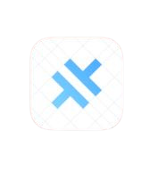

# Challengly App


## Features

- ✨ **Beautiful, animated onboarding** (interests, motivation, difficulty)
- 🏆 **Personalized daily challenges** (reveal, progress, celebrations)
- ⏱️ **Timer/progress tracking** with persistence (across app states)
- 🎉 **Confetti \& micro-interactions** (for delightful feedback)
- 💬 **AI-inspired chat assistant** (streaming, quick replies, context-aware)
- 📈 **Streak \& progress tracking**
- 📱 **Mobile-first, responsive design**
- 🖼️ **Shareable challenge cards**
- 🧠 **Robust edge case handling** (rapid taps, long/empty messages, backgrounding)

## Screenshots

| Onboarding 1                                         | Onboarding 2                                         | Onboarding 3                                         | Onboarding 4                                         |
| ---------------------------------------------------- | ---------------------------------------------------- | ---------------------------------------------------- | ---------------------------------------------------- |
|  |  |  |  |

| Dashboard                                      | Chat Assistant                       | Profile                                    |
| ---------------------------------------------- | ------------------------------------ | ------------------------------------------ |
|  |  |  |

## Setup Instructions (Web)

1. **Clone the repository:**

```sh
git clone <YOUR_GIT_URL>
cd <YOUR_PROJECT_NAME>
```

2. **Install dependencies:**

```sh
npm install
```

3. **Start the development server:**

```sh
npm run dev
```

4. **Open the app:**
   - Visit [http://localhost:5173](http://localhost:5173) in your browser.

## Mobile Instructions (iOS \& Android with Capacitor)

> Prerequisites: Node.js, npm, Xcode (for iOS), Android Studio (for Android), and the latest version of Capacitor

1. **(If not already done) Initialize Capacitor configuration:**

```sh
npx cap init
```

2. **Build the project:**

```sh
npm run build
```

3. **Add iOS and Android platforms:**
   - iOS:

```sh
npx cap add ios
```

    - Android:

```sh
npx cap add android
```

4. **Open the respective platform's IDE:**
   - iOS (Xcode):

```sh
npx cap open ios
```

    - Android (Android Studio):

```sh
npx cap open android
```

5. **Run \& test on device or emulator:**
   - Use the IDE (Xcode/Android Studio) to build and run the app on simulator or real device.

> **Note:** If you make UI or logic changes, re-run `npm run build` and sync the build with:
> `sh > npx cap sync > `

## Test Instructions

- **Unit/Integration tests:** (If test scripts are present)

```sh
npm test
```

- **Add tests:** If not present, add with a preferred framework (e.g., Jest, React Testing Library).

## Architecture Overview

```mermaid
flowchart TD
    A[App Entry (src/App.tsx)] --> B[Routing (react-router-dom)]
    B --> C1[Dashboard]
    B --> C2[Chat]
    B --> C3[Profile]
    C1 --> D1[Challenge State & Timer]
    C1 --> D2[Confetti & Share Card]
    C2 --> E1[ChatInput]
    C2 --> E2[MessageBubble]
    C2 --> E3[QuickReplies]
    C2 --> E4[Chat State Persistence]
    C1 --> F1[BottomNavigation]
    C2 --> F1
    C3 --> F1
```

- **Routing:** `react-router-dom`
- **Pages:** Dashboard, Chat, Profile
- **Components:** Modular UI (shadcn-ui), custom chat, confetti, share card, etc.

## State Management

- **Local State:** React `useState`, `useEffect`
- **Persistence:** `localStorage` (for user prefs, progress, chat, timer)
- **Why:** Fast, robust, and simple for single-user, client-side use; no Redux required.

## Performance Optimizations

- **Timer persistence:** Synced to `localStorage` every second (restores after reload/navigation)
- **Chat virtualization:** Efficient message rendering, streaming (auto-scroll)
- **Minimal re-renders:** Targeted state updates
- **Optimized animations:** GPU-accelerated CSS for confetti, chat, and transitions

## Chat Implementation \& Design

- **Hardcoded AI:** Keyword/context-matched, varied response set (not using external API)
- **Streaming output:** AI responses typed out
- **Typing indicator:** Animated dots, realistic delays
- **Expandable input:** Grows to 5 lines, with character counter/color feedback
- **Quick replies:** Contextual, conditional display
- **Persistence:** Chat history per challenge in `localStorage`
- **Robust edge case handling:** Rapid sends, long/empty messages, repeated triggers, backgrounding
- **Design inspiration:** Modern chat UIs (ChatGPT, Claude, Cursor)

## Notes

- Built with Vite, React, TypeScript, shadcn-ui, and Tailwind CSS.

Happy Challenging!

<div style="text-align: center">⁂</div>
